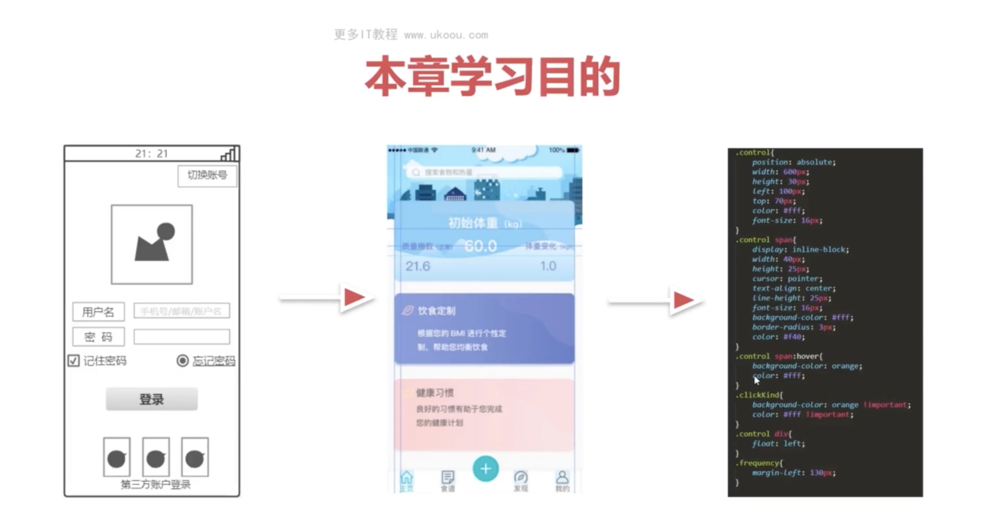
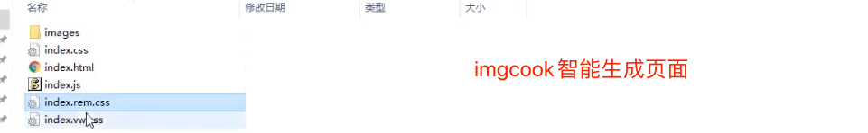
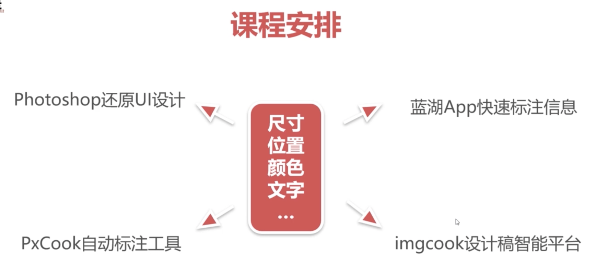
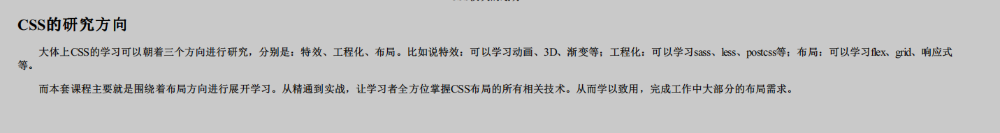
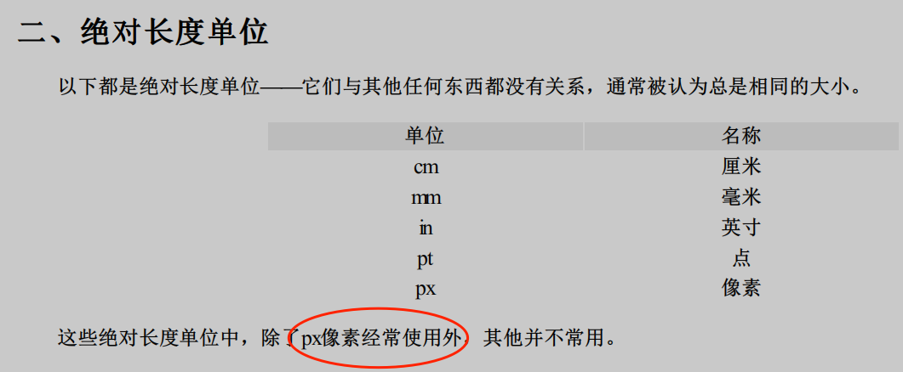
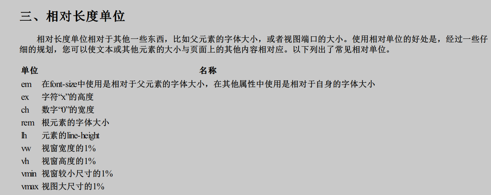
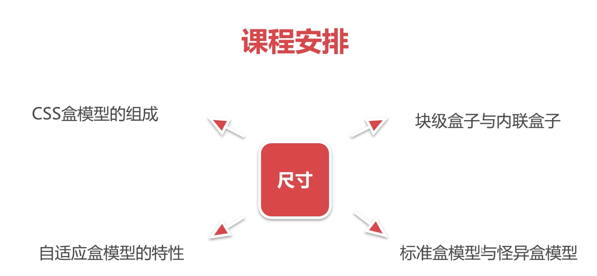
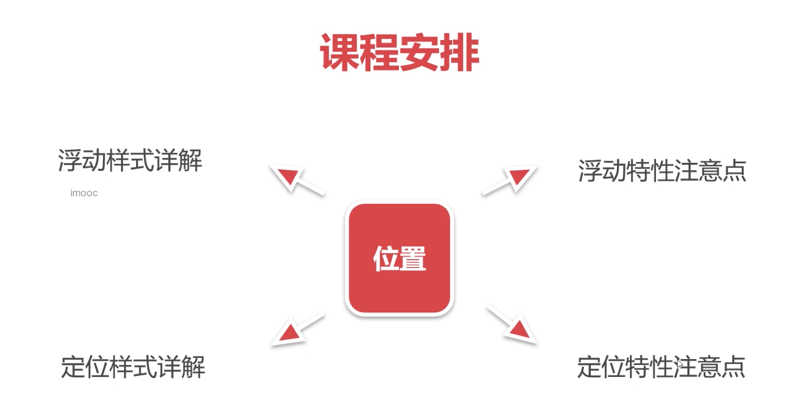
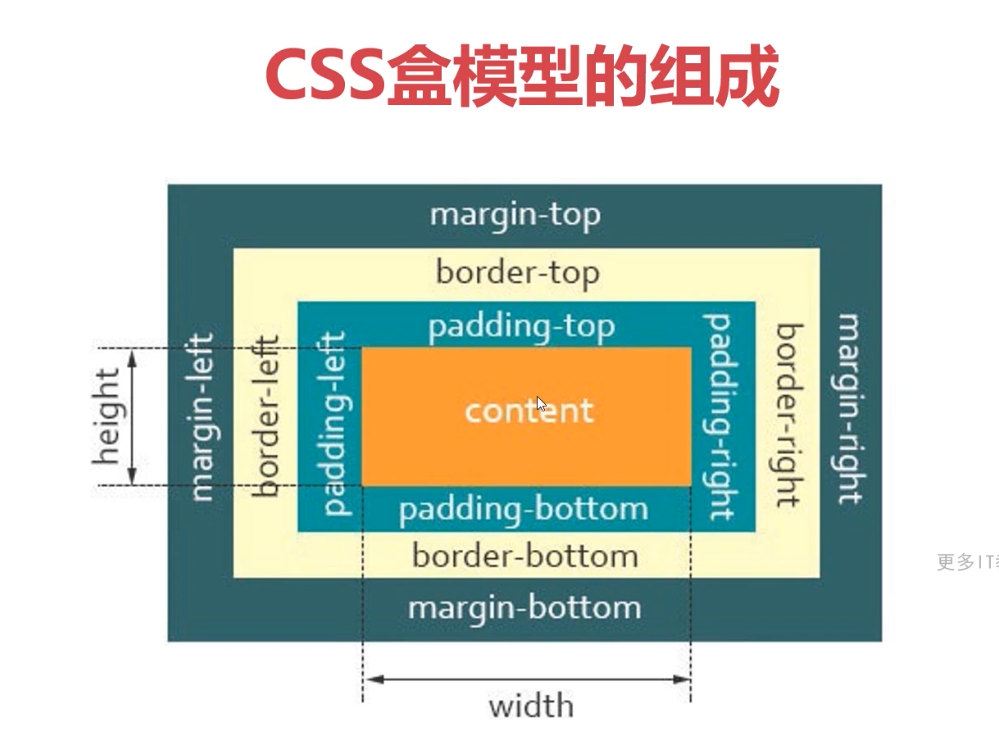
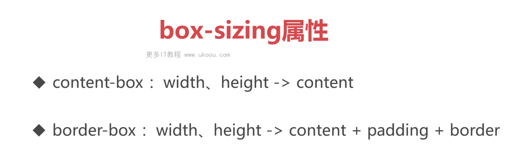

## 目的
- 给自己看
- 希望能够帮助到像我一样的初学者


## CSS练习网站
- 选择器的练习: https://flukeout.github.io/
- grid布局的练习： https://cssgridgarden.com/
- flex布局的练习: https://flexboxfroggy.com/
- CSS的竞技网站(还没怎么看): https://cssbattle.dev/


## 前置知识

- 知道基本的CSS：属性的写法， 选择器，等

## 页面的开发流程

1. 产品画原型图
2. 设计出视觉稿
3. 前端还原视觉稿



## 切图工具

> 切图就是 获取设计稿中的标注等信息。测量各种UI的信息，尺寸，颜色，字体等。
>
> 设计工具 photoshop
>
> 蓝湖：测量UI的信息，自动单位转换 px -> rem
>

#### pxcook: 支持px/rem/vw/wh 适合移动端的项目

imgcook: 自动从设计稿生成代码




- 逻辑像素和物理像素？？这个怎么理解？



  对尺寸，颜色，等信息的获取


### 常见的UI文件

- PSD Sketch XD （这些都是对应设计师用的设计工具）

### CSS的研究方向




## 单位 绝对长度单位和相对长度单位



vw rem




## 布局尺寸位置





- display属性
- 书写模式与逻辑属性
- BFC
- 标签默认样式与清除方案


## 盒模型



- 背景色会平铺到非Margin的区域,即：border区域


- margin-top传递的现象, 子元素的margin-top传递给父元素。 直观：子元素会把父元素往下带

```css
BFC可以解决该问题
```

- margin上下叠加

```csss
.box1 {
margin-bottom:40px;
}
.box2 {
margin-top:50px;
}

// 50px;
```

**建议使用现代布局： flex, margin**


### 块级盒子和内联盒子 display

- 块级盒子 Div,h1,p

```css
不写宽度的时候，和父容器的宽度相同
所占据的区域是矩形

（该盒子适合做布局）
```


- 内联盒子 Span,a,strong,em

```css
不写宽度的时候，该盒子宽度与内容相同，不支持宽高
各个盒子之间有空隙

（不要选择内联盒子做布局，适合做文本修饰）
```


### 自适应盒模型： 不设置宽高！！！！

自适应的表现，内联盒子的宽高和内容的宽高和内容一样；块级盒子的宽高自动铺满父元素

### 怪异盒模型和标准盒模型

**这里探讨的问题是怎么计算盒子的真正大小**,更具体的内容：盒子的大小是否包含padding,border等



- content-boxIE盒模型 `box-sizing:content-box;`
- border-box怪异盒模型 `box-sizing:border-box;`

```css
calc
```

