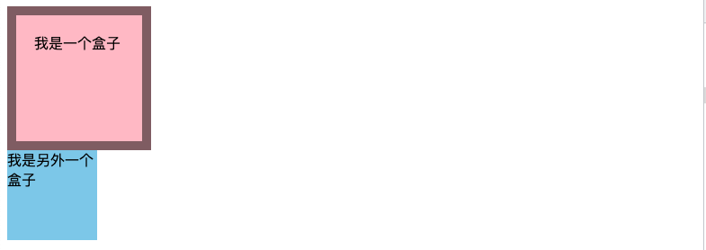
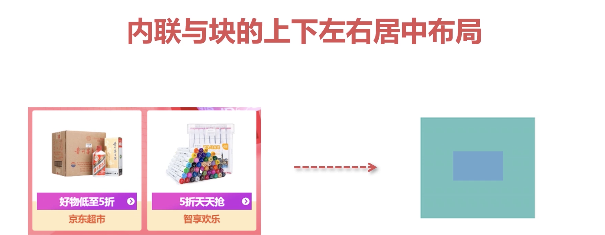
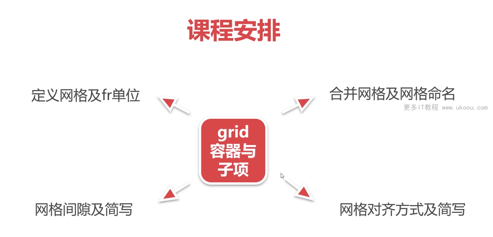
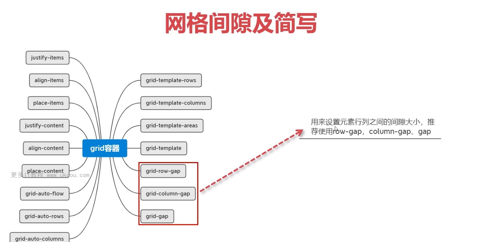
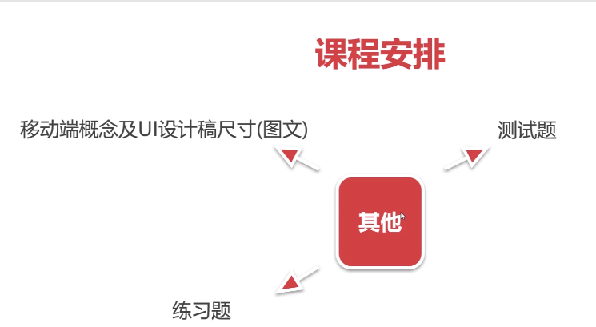
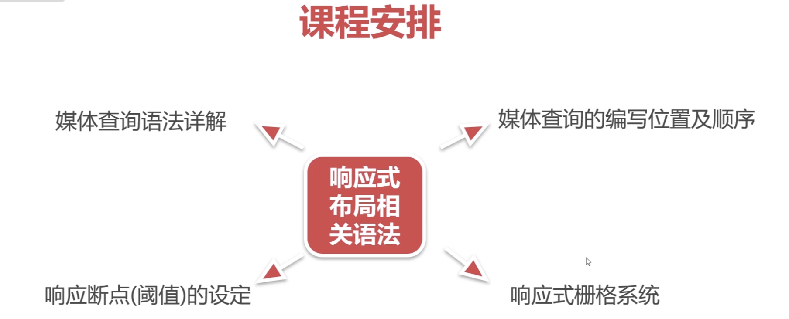

# x前端主流布局系统进阶与实战


## 目的

- 给自己看
- 希望能够帮助到像我一样的初学者


## CSS练习网站
- 选择器的练习: https://flukeout.github.io/
- grid布局的练习： https://cssgridgarden.com/
- flex布局的练习: https://flexboxfroggy.com/
- CSS的竞技网站(还没怎么看): https://cssbattle.dev/


## 前置知识

- 知道基本的CSS：属性的写法， 选择器，等

## 页面的开发流程

1. 产品画原型图
2. 设计出视觉稿
3. 前端还原视觉稿


## 切图工具

> 切图就是 获取设计稿中的标注等信息。测量各种UI的信息，尺寸，颜色，字体等。
>
> 设计工具 photoshop

##### 设计工具 photoshop

##### 蓝湖：测量UI的信息，自动单位转换 px -> rem

##### pxcook: 支持px/rem/vw/wh 适合移动端的项目

##### imgcook: 自动从设计稿生成代码


- 逻辑像素和物理像素？？这个怎么理解？


  对尺寸，颜色，等信息的获取


### 常见的UI文件

- PSD Sketch XD （这些都是对应设计师用的设计工具）

### CSS的研究方向

- 特效的研究：动画，3D, 渐变
- 工程化： sass,less, postcss
- 布局: flex,grid,响应式布局


## 单位 绝对长度单位和相对长度单位


vw rem


## 布局尺寸位置


- display属性
- 书写模式与逻辑属性
- BFC
- 标签默认样式与清除方案


## 盒模型


- 背景色会平铺到非Margin的区域,即：border区域



- **margin-top传递的现象, 子元素的margin-top传递给父元素。** 直观：子元素会把父元素往下带

```css
BFC可以解决该问题
```

- margin上下叠加

```csss
.box1 {
margin-bottom:40px;
}
.box2 {
margin-top:50px;
}

// 50px;
```

**建议使用现代布局： flex, margin**


### 块级盒子和内联盒子 display

- 块级盒子 Div,h1,p

```css
不写宽度的时候，和父容器的宽度相同
所占据的区域是矩形

（该盒子适合做布局）
```


- 内联盒子 Span,a,strong,em

```css
不写宽度的时候，该盒子宽度与内容相同，不支持宽高
各个盒子之间有空隙

（不要选择内联盒子做布局，适合做文本修饰）
```


### 自适应盒模型： 不设置宽高！！！！

自适应的表现，内联盒子的宽高和内容的宽高和内容一样；块级盒子的宽高自动铺满父元素

### 怪异盒模型和标准盒模型

**这里探讨的问题是怎么计算盒子的真正大小**,更具体的内容：盒子的大小是否包含padding,border等


- content-boxIE盒模型 `box-sizing:content-box;`
- border-box怪异盒模型 `box-sizing:border-box;`

```css
calc
```


## 浮动 float ？ 

> mdn

- 文档流：块级从上到下，每个元素独占一行; 内联从左到右，排不下换行
- 设置为浮动，**脱离文档流**，左右布局的一种实现方式，向左或者向右排列
- 清除浮动的方案

```css
1. clear:left,right,both 上下关系的
2. BFC
3. 空标签
.clearfix::afterx {
  
}

```

#### 浮动布局的注意点

- 只会影响在浮动元素之后的元素
- 文字


## 定位


### 相对定位 position:relative;

相对于自身在正常文档中的偏移

不会脱离文档流，不会影响其他元素的布局

### 绝对定位  positon:absolute;

- 脱离文档流
- 绝对定位元素相对于最近的非static祖先元素定位。 当这样的祖先元素不存在时，则相对于**可视区**定位。

### 固定定位

- 固定定位是相对于浏览器的可视区：浏览器窗口的区域，用户一直可以看到的

### 粘性定位

> 表格当中，首行冻结。 

父元素加上绝对定位

- 应用： 因此，滚动的时候，后面的新闻标题才能把前面已经sticky定位的新闻标题推开，这是sticky定位天然的特性，无需任何JavaScript的帮助 : https://www.zhangxinxu.com/wordpress/2018/12/css-position-sticky/


## dispaly属性

## 书写模式与逻辑属性

>  这点对于国际化很重要,对于不同的国家的文字显示不同因此可

## BFC

### 出发条件

1. float的值不是none
2. postition的值不是static或者relative
3. display的值是inline-block, talbe-cell, flex, table-caption 后者inline-flex
4. overflow的值不是visible

### 应用

- 解决margin垂直的折叠
- 浮动元素的父容器高度塌陷问题

## reset浏览器的默认样式

清除浏览器的默认样式，保证当前的页面与设计稿一致

### 相关资源

- https://meyerweb.com/eric/tools/css/reset/


## flex布局

**适合做一维布局**， 一行行，一列列


### flex的基本概念

###### flex容器

- `flex-direction` (控制**主轴**的方向)
  - row
  - row-reverse
  - column
  - column-reverse
- `flex-wrap`  (当空间不够的时候，多行显示，子项不伸缩)
  - nowrap
  - wrap
  - wrap-reverse
- `flex-flow`
- `justify-content`
  - flex-start
  - center
  - flex-end
- `align-items `
- `align-content`


### flex容器

### flex子项

- `flex-grow`  比例值大于等于1的时候，占满所有的剩余。 根据比例来分配剩余空间
- `flex-shrink`  默认值为1. 表示容器空间不足时，元素的收缩比例。 `0`表示不收缩 ， 溢出空间

```css
当空间不足时，未设置flex-shrink则根据当前元素的宽度进行占比
```


- `flex-basis`  
- `align-self` 


#### 总结

- flex容器的相关功能与语法
- flex容器相关布局
- flex子项相关功能及语法
- flex子项相关布局机器应用
- flex综合案例，swiper轮播图，知乎导航 ` (空间拉伸)`

### 各种常见的布局 (经典面试题)

### 常见案例

###### 内联与块的上下左右居中布局



##### 不定项的居中布局 (意味着项目的数量不确定 )


###### 均分列布局


###### 子项分组布局 flex + margin-right:auto `nth-of-type() 选择器`


##### 等高布局 flex


#### 粘性页脚


##### 溢出项布局 ?? 不是很理解


## 网格布局 grid

web的二维布局系统，利用网格进行行列排版




### 


### grid容器


#### 定义网格

- 主要有两个属性来划分网格`grid-template-rows`和`grid-template-columns`接受`fr`单位平分剩余空间，或者`px`

  或者`px`后者`百分比`

```css
.container {
  display: grid;
  grid-template-rows:50% 20% auto;
  grid-template-columns: 100px 100px 100px;
}
```

- 网格命名 `grid-template-areas` 然后划分

默认按照网格自动填充（使用子元素填充）

```html
<style>
        .main {
            width: 300px;
            height: 300px;
            background-color: skyblue;
          
            display: grid;
            grid-template-columns: 1fr 1fr 1fr;
            grid-template-rows: 1fr 1fr 1fr;
            grid-template-areas: 
            "a1 a1 a2"
            "a1 a1 a2" 
            "a3 a3 a3";
        }
        .main div {
            background-color: pink;
            border:1px black solid;

        }
        .main div:nth-of-type(1) {
            grid-area: a1;
        }
        .main div:nth-of-type(2) {
            grid-area: a2;
        }
        .main div:nth-of-type(3) {
            grid-area: a3;
        }
    </style>
</head>
<body>
    <div class="main">
        <div>1</div>
        <div>2</div>
        <div>3</div>
    </div>
</body>
```

`grid-template`

```css
.main {
  grid-template:
}
```


#### 网格间隙

- 过时的写法,`grid-row-gap` `grid-column-gap` 简写 `grid-gap`
- **推荐使用 `row-gap`和`column-gap`， 简写 `gap`  flex中的写法也一样**

```html
<!DOCTYPE html>
<html lang="en">
<head>
    <meta charset="UTF-8">
    <meta http-equiv="X-UA-Compatible" content="IE=edge">
    <meta name="viewport" content="width=device-width, initial-scale=1.0">
    <title>grid系统划分</title>
    <style>
        .main {
            width: 500px;
            height: 500px;
            background-color: skyblue;

            /* 进行网格划分 */
            display: grid;
            grid-template-rows: 1fr 1fr 1fr;
            grid-template-columns: 1fr 1fr 1fr;
            grid-template: 
            "a1 a1 a2"
            "a1 a1 a2"
            "a3 a3 a3";

            /* grid-row-gap: 20px;
            grid-column-gap: 30px; */

            /* row-gap:20px;
            column-gap:30px; */

            /* 先行后列 */
            grid-gap:20px 30px;
        }
        .main div {
            background-color: pink;
        }

        /* 控制子元素占位 */
        .main div:nth-of-type(1){  /* 1 */
            grid-area: a1;
            background-color: yellow;
        }
        .main div:nth-of-type(2){  /* 1 */
            grid-area: a2;
            background-color: green;
        }
        .main div:nth-of-type(3){  /* 1 */
            grid-area: a3;
            background-color: aqua;
        }

        /* 展示flex中的gap */
        .container {
            width: 500px;
            display: flex;
            flex-wrap: wrap;
            /* row-gap: 10px;
            column-gap:20px; */
            gap:10px 20px;
        }
        .container div {
            width: 100px;
            height: 100px;
            background-color: green;
        }
    </style>
</head>
<body>
    <h2>显示grid中的案例</h2>
    <div class="main">
        <div>1</div>
        <div>2</div>
        <div>3</div>
    </div>
    <hr>

    <h2>显示flex中的gap案列</h2>
    <div class="container">
        <div>1</div>
        <div>2</div>
        <div>3</div>
        <div>4</div>
        <div>5</div>
        <div>6</div>
    </div>
</body>
</html>
```





**以上代码是对该容器进行了划分，系统自动使用布局填充内容。**

## 网格对齐

- justify-items, align-items
- justify-content, -align-content 


##### 行列起始位置的缩写


##### 简写方式

- `repeat`

```css
.main {
  grid-template-columns:repeat(3,100px);
}
```


- `grid-auto-rows: 100px;` 自动根据屏幕分辨率适配


### 案例


#### 栅格布局


## 移动端适配

>  实现各种设备的屏幕适配

- 逻辑像素：CSS中的像素，绝对单位，保证不同设备下尺寸是相同的。

- 物理像素：设备屏幕拥有的像素点，相对单位，不同设备下的像素大小不同。

### 以iphone6为例

通常设计师在给出移动端的设计稿的时候都会按照iphone6的物理像素的尺寸 750px。当然也可以按照逻辑像素进行设计，即375px,但设计师一般不会这么干，主要是为了设计稿清晰。

所以前端在量取尺寸的时候，需要除以2	，才能够适配CSS的逻辑像素。

**相对单位：rem, vw**

### rem


### vw





### 1em

> 默认的1em等于16pxs
>
> rem: root + em;

**为啥一直是iphone6**

**熟练使用PS来进行切图**：测量图标的大小，辅助线等等


### 使用PS软件来切图


- 逻辑像素: 前端CSS像素
- 物理像素：设备拥有的的像素点，一个设备生产出来像素点已经确定了。

​	


`user-scalable=no`可以解决移动端点击时间问题

#### 借助px to rem插件换算成REM

> macbook上的快键键是 `options + z`
>
> windows上的快捷键是 `ctrl+z`


### 移动端的vm布局的使用

- ps转换为vw插件 `px-to-vw`

- 设置插件的viewportWidth: 375 (iphone下的情况来演示)  
- 使用快捷键，选择代码 + `options + Z`


除以2来计算px单位，然后使用插件来转换? 这里为什么要除以2？


## bilibili首页实战

flex默认会收缩

### 移动端布局总结


## 响应式布局

- 网页能够自动识别屏幕宽度，并做出相应的调整的网页设计。响应式布局可以为不同的用户提供更加舒适的界面和更好的用户体验。

### 媒体查询实现响应式




### 媒体查询语法


